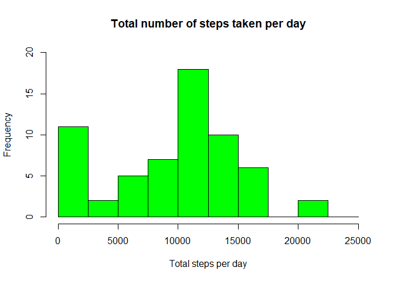
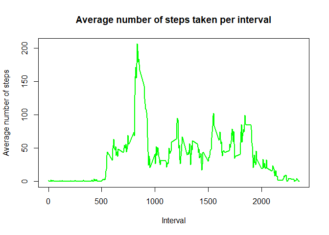
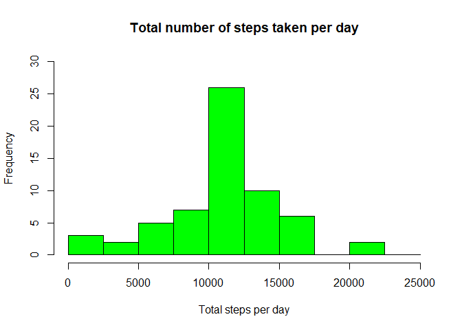
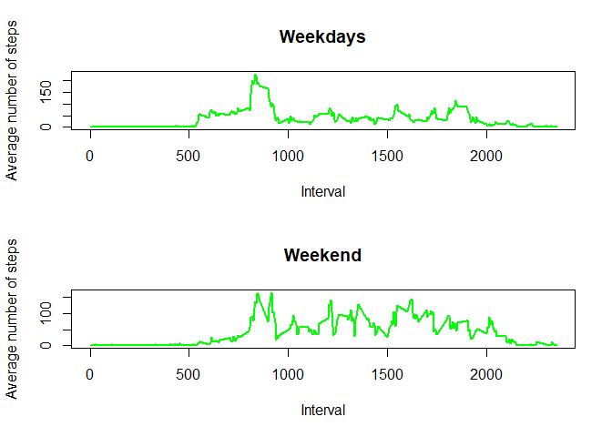

## Loading and preprocessing the data
Load the required packages. Unzip the data file and read the activity data into R. Convert the dates into a Date class.

```r
library(dplyr)
```

```
## 
## Attaching package: 'dplyr'
```

```
## The following objects are masked from 'package:stats':
## 
##     filter, lag
```

```
## The following objects are masked from 'package:base':
## 
##     intersect, setdiff, setequal, union
```

```r
unzip("activity.zip")
activity <- read.csv("activity.csv")
activity$date <- as.Date(activity$date, format="%Y-%m-%d")
```


## What is mean total number of steps taken per day?
Calculate the total number of steps taken per day.

```r
tot_steps <- summarize(group_by(activity, date), steps=sum(steps, na.rm=T))
```

Make a histogram of the total number of steps taken each day.

```r
hist(tot_steps$steps, breaks=seq(0,25000, by=2500), ylim=c(0, 20), main="Total number of steps taken per day", xlab="Total steps per day", col="green")
```

<!-- -->

Calculate and report the mean and median of the total number of steps taken per day.
The mean total number of steps taken per day is:

```r
mean(tot_steps$steps)
```

```
## [1] 9354.23
```

The median total number of steps taken per day is:

```r
median(tot_steps$steps)
```

```
## [1] 10395
```


## What is the average daily activity pattern?
Make a time series plot of the 5-minute interval (x-axis) and the average number of steps taken, averaged across all days (y-axis).

```r
average_steps <- summarize(group_by(activity, interval), steps=mean(steps, na.rm=T))
plot(average_steps$interval, average_steps$steps, type="l", lwd=2, col="green", main="Average number of steps taken per interval", xlab="Interval", ylab="Average number of steps")
```

<!-- -->

Which 5-minute interval, on average across all the days in the dataset, contains the maximum number of steps?

```r
average_steps[which.max(average_steps$steps), ]$interval
```

```
## [1] 835
```


## Imputing missing values
Calculate and report the total number of missing values in the dataset.

```r
sum(is.na(activity$steps))
```

```
## [1] 2304
```

Devise a strategy for filling in all of the missing values in the dataset. The missing values will be filled in with the mean of their 5-minute interval, for which the following function will be used.

```r
getAverageStepsInterval <- function(interval){
    average <- summarize(group_by(activity, interval), steps=mean(steps, na.rm=T))
    average[average$interval==interval, ]$steps
}
```

Create a new dataset that is equal to the original dataset but with the missing data filled in.

```r
activity_noNA <- activity
for(i in 1:nrow(activity_noNA)){
    if(is.na(activity_noNA[i, ]$steps)){
        activity_noNA[i, ]$steps <- getAverageStepsInterval(activity_noNA[i, ]$interval)
    }
}
```

Make a histogram of the total number of steps taken each day and calculate and report the mean and median total number of steps taken per day.

```r
tot_steps_noNA <- summarize(group_by(activity_noNA, date), steps=sum(steps, na.rm=T))
hist(tot_steps_noNA$steps, breaks=seq(0,25000, by=2500), ylim=c(0, 30), main="Total number of steps taken per day", xlab="Total steps per day", col="green")
```

<!-- -->

The mean total number of steps taken per day is:

```r
mean(tot_steps_noNA$steps)
```

```
## [1] 10766.19
```

The median total number of steps taken per day is:

```r
median(tot_steps_noNA$steps)
```

```
## [1] 10766.19
```


## Are there differences in activity patterns between weekdays and weekends?
Create a new factor variable in the dataset with two levels – “weekday” and “weekend” indicating whether a given date is a weekday or weekend day.

```r
activity_noNA$day <- weekdays(activity_noNA$date)
for(i in 1:nrow(activity_noNA)){
    if(activity_noNA[i,]$day %in% c("zaterdag","zondag")){
        activity_noNA[i,]$day <- "weekend"
    }else{
        activity_noNA[i,]$day <- "weekday"
    }
}
```

Make a panel plot containing a time series plot of the 5-minute interval (x-axis) and the average number of steps taken, averaged across all weekday days or weekend days (y-axis).

```r
average_steps_weekend <- summarize(group_by(activity_noNA[activity_noNA$day=="weekend",], interval), steps=mean(steps, na.rm=T))
average_steps_weekday <- summarize(group_by(activity_noNA[activity_noNA$day=="weekday",], interval), steps=mean(steps, na.rm=T))

par(mfcol=c(2,1))
plot(average_steps_weekday$interval, average_steps_weekday$steps, type="l", lwd=2, col="green", main="Weekdays", xlab="Interval", ylab="Average number of steps")
plot(average_steps_weekend$interval, average_steps_weekend$steps, type="l", lwd=2, col="green", main="Weekend", xlab="Interval", ylab="Average number of steps")
```

<!-- -->
